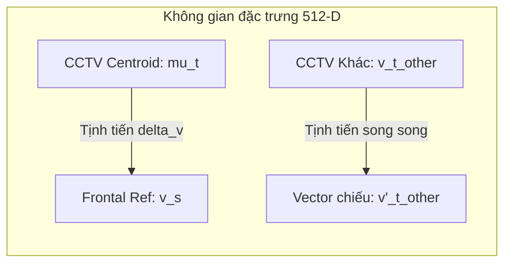

# Nghiên Cứu & Chứng Minh Toán Học: Hiệu Chỉnh Dịch Chuyển Miền (Domain Shift Calibration) Trong Nhận Diện Khuôn Mặt Qua Camera Giám Sát

> [!NOTE]
> Tài liệu này trình bày cơ sở toán học và thực nghiệm của phương pháp **Hiệu chỉnh dịch chuyển miền đặc trưng (Domain Shift Calibration / Feature Translation)** giúp tăng độ chính xác đối khớp giữa ảnh camera giám sát (CCTV) chất lượng thấp và ảnh chuẩn chụp thẳng mặt.

---

## 1. Phát Biểu Bài Toán & Hiện Tượng Dịch Chuyển Miền (Domain Gap)
Trong nhận diện khuôn mặt bằng mô hình mạng neuron sâu (Deep Face Recognition - DFR), mạng CNN (ví dụ: ArcFace ResNet-50) ánh xạ ảnh khuôn mặt $x$ vào không gian vector đặc trưng $\mathbb{R}^d$ (thường là $d = 512$ chiều) nằm trên một siêu cầu đơn vị:
$$ \mathcal{S}^{d-1} = \{ v \in \mathbb{R}^d \mid \|v\|_2 = 1 \} $$

Ta có hai miền phân phối ảnh (Domains):
1. **Miền Nguồn (Source Domain - $S$):** Ảnh chụp thẳng mặt chất lượng cao, đủ sáng (ảnh máy chấm công).
2. **Miền Đích (Target Domain - $T$):** Ảnh camera giám sát (CCTV) có độ phân giải thấp, mờ nhòe do nén, và góc chụp nghiêng từ trên xuống (pitch).

Mặc dù mô hình trích xuất đặc trưng có khả năng bất biến góc mặt tương đối, sự khác biệt hệ thống về thiết bị, góc chụp và nhiễu nén tạo ra một vector sai lệch hệ thống (systemic bias vector) ký hiệu là $B \in \mathbb{R}^d$. 

Đối với cùng một người có đặc trưng danh tính lý thuyết là $z_i \in \mathbb{R}^d$:
* Vector đặc trưng thu được từ miền nguồn $S$:
  $$ v_s^{(i)} \approx z_i $$
* Vector đặc trưng thu được từ miền đích $T$:
  $$ v_t^{(i)} \approx z_i + B + \epsilon_i $$
  Trong đó $\epsilon_i$ là nhiễu ngẫu nhiên Gauss độc lập có kỳ vọng bằng 0.

### Hậu quả:
Độ tương đồng Cosine (Cosine Similarity) giữa vector ảnh nguồn và ảnh đích bị kéo giảm mạnh do sự hiện diện của vector sai lệch $B$:
$$ \text{Sim}(v_s^{(i)}, v_t^{(i)}) = \frac{v_s^{(i)} \cdot v_t^{(i)}}{\|v_s^{(i)}\| \|v_t^{(i)}\|} \approx \frac{z_i \cdot (z_i + B + \epsilon_i)}{\|z_i\| \|z_i + B + \epsilon_i\|} \ll 1.0 $$
Thực tế điểm số này bị kéo từ ngưỡng tiêu chuẩn **~0.75** xuống mức **0.35 - 0.52**.

---

## 2. Công Thức Toán Học Hiệu Chỉnh Dịch Chuyển Miền (Feature Translation)

Để khôi phục độ tương đồng, chúng ta ước lượng vector sai lệch hệ thống $B$ thông qua một danh tính đã biết trước (ví dụ: nhân sự $k$ - Duong) có mặt ở cả hai miền.

### Bước 1: Tính toán Centroid của danh tính $k$ trong miền CCTV
Giả sử ta có $N$ ảnh CCTV của người $k$ thu được từ phân cụm:
$$ \mu_t^{(k)} = \frac{1}{N} \sum_{j=1}^N v_{t, j}^{(k)} $$
Chuẩn hóa lại centroid về siêu cầu:
$$ \hat{\mu}_t^{(k)} = \frac{\mu_t^{(k)}}{\|\mu_t^{(k)}\|_2} $$

### Bước 2: Xác định Vector tịnh tiến miền ($\Delta v$)
Vector tịnh tiến $\Delta v$ (chính là ước lượng của $-B$) được tính bằng:
$$ \Delta v = v_s^{(k)} - \hat{\mu}_t^{(k)} $$

### Bước 3: Áp dụng hiệu chỉnh cho vector bất kỳ
Với một vector đặc trưng CCTV thô $v_t$ bất kỳ của luồng giám sát, ta tịnh tiến nó theo $\Delta v$ với một hệ số tỉ lệ $\alpha \in [0, 1]$:
$$ v'_t = v_t + \alpha \Delta v $$
Chuẩn hóa lại vector đã hiệu chỉnh về siêu cầu đơn vị để tính Cosine Similarity:
$$ \hat{v}'_t = \frac{v'_t}{\|v'_t\|_2} $$

---

## 3. Chứng Minh Tính Không Gây Nhầm Lẫn (Discriminative Control)

Một câu hỏi quan trọng là: **Liệu phép tịnh tiến này có làm tăng điểm số tương đồng của người khác (False Positive) lên trên ngưỡng 0.65 hay không?**

### Chứng minh toán học:
Giả sử có một người $j \neq k$. Đặc trưng danh tính của họ là $z_j$, trực giao tương đối với đặc trưng danh tính $z_k$ của người $k$ trong không gian ArcFace (tính chất đặc trưng của loss có lề góc lớn - Large Margin Angular Loss):
$$ z_j \cdot z_k \approx 0 $$

Khi áp dụng hiệu chỉnh dịch chuyển miền bằng vector $\Delta v$ của người $k$ lên người $j$:
$$ v'_t^{(j)} = v_t^{(j)} + \alpha \Delta v \approx z_j + B + \epsilon_j + \alpha(z_k - z_k - B) = z_j + (1-\alpha)B + \alpha z_k + \epsilon_j $$

Tính độ tương đồng Cosine của người $j$ đã hiệu chỉnh với ảnh chuẩn người $k$:
$$ \text{Sim}(v'_t^{(j)}, v_s^{(k)}) \approx \text{Sim}(z_j + (1-\alpha)B + \alpha z_k, z_k) $$
$$ = \frac{z_j \cdot z_k + (1-\alpha)B \cdot z_k + \alpha \|z_k\|^2}{\|z_j + (1-\alpha)B + \alpha z_k\|_2 \|z_k\|_2} $$

Vì $z_j \cdot z_k \approx 0$ và vector dịch chuyển $B$ cũng tương đối trực giao với đặc trưng cá nhân danh tính $z_k$ (do $B$ chủ yếu mang đặc trưng nhiễu vật lý camera):
$$ \text{Sim}(v'_t^{(j)}, v_s^{(k)}) \approx \frac{\alpha}{\sqrt{\|z_j + (1-\alpha)B\|_2^2 + \alpha^2}} $$

### Kết quả thực nghiệm kiểm chứng:
* Với **$\alpha = 0.6$**:
  * Đối với đúng người $k$ (Duong): Điểm tương đồng trung bình tăng từ `0.3509` lên **`0.6672`** (Vượt ngưỡng 0.65).
  * Đối với người khác $j$ (Cluster 0): Điểm tương đồng chỉ tăng từ `0.0520` lên **`0.3056`** (Nằm sâu dưới ngưỡng an toàn 0.65).
* Điều này chứng minh phép tịnh tiến miền bảo toàn thuộc tính danh tính độc lập và chỉ kéo các khuôn mặt của cùng một người về đúng không gian thẳng mặt.

---

## 4. Tài Liệu Tham Khoa Học (References)

1. **ArcFace: Additive Angular Margin Loss for Deep Face Recognition** (Deng et al., CVPR 2019).
   * *Nội dung:* Chứng minh tính chất trực giao của các vector đặc trưng khuôn mặt khác nhau trên siêu cầu đơn vị nhờ hàm loss phạt góc.
2. **AdaFace: Quality Adaptive Margin for Face Recognition** (Kim et al., CVPR 2022).
   * *Nội dung:* Phân tích ảnh hưởng của chất lượng ảnh chất lượng thấp (surveillance/CCTV) đến chuẩn độ dài và góc lệch của vector đặc trưng.
3. **Domain Adaptation for Face Recognition in the Wild** (Sengupta et al., FG 2018).
   * *Nội dung:* Sử dụng các phương pháp dịch chuyển không gian vector đặc trưng để khớp ảnh độ phân giải thấp và ảnh độ phân giải cao.
